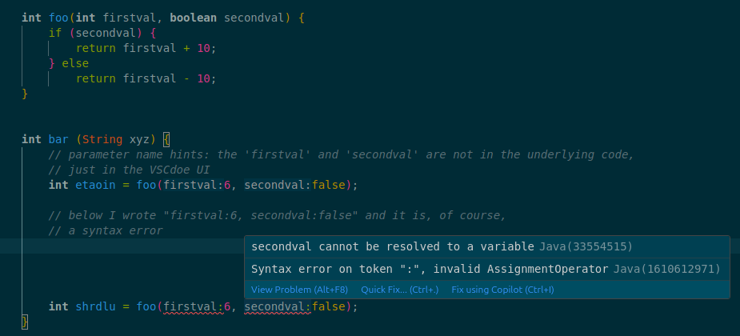

# Instructor notes

This is a living document of notes for instructors. "Living" means you
should feel free to make any changes, additions, updates, or otherwise
to this -- either by editing it right on GitHub, making a fork and PR,
or just leaving an issue in the repo.

Think of this like a wiki -- something that gets frequently updated and
modified, and remember [Wikipedia's "be bold" editing
guideline](https://en.wikipedia.org/wiki/Wikipedia:Be_bold).

## Installing software

### ARM-based Windows computers

Sooner or later some student is going to have an ARM-based Windows computer.

Based on testing a Snapdragon-based Copilot PC on display at Costco: the
adoptium.net site does default to an x86 download, but does have options
for aarch64. VS Code also offers arm64 options. I wasn't able to see
what the git homepage does, but you can click through and get arm64
builds.

Let's wait to update our instructions until we actually have a student
encounter this.

## Configuring VS Code

### Disabling inlay/parameter hints

VS Code may, by default, show "inlay hints" (also called parameter
hints): the slightly-dimmed text that the VS Code UI inserts to tell you
the name of the corresponding parameter's name.

This can be very confusing, especially because of the way the UI
displays those hints:



Note the extremely easy-to-miss background highlighting for the hint.

If this is turned on, students will very likely run into these syntax
errors, and have no idea how to fix it, since it appears almost
identical to the first line that shows no syntax error.

**To turn off parameter hints:** open Settings (ctrl/cmd comma) and
search for "inlay" and turn off the inlay hints.

(In the command palette, there's "trigger parameter hints", but that's
different -- it shows a little popup with the function signature.)

### Turn off Copilot

Copilot is very eager to be helpful, and for a language like Java and
example like the Game of Life, there is so much training data that any
reasonable chatbot these days can write *everything* for the student.

If the student enabled GitHub Copilot (or VS Code did so for them), go
to the Extensions pane, search for "copilot" and uninstall the
extensions. (There's Copilot, and Copilot Chat).

But! Copilot Chat and such seems to be deeply baked into VS Code these
days. I followed [these
instructions](https://stackoverflow.com/a/79449364) and added these
settings to `defaultSettings.json`:

```
"github.copilot.enable": false,
"github.copilot.editor.enableAutoCompletions": false,
"github.copilot.editor.enableCodeActions": false,
"github.copilot.nextEditSuggestions.enabled": false,
"github.copilot.renameSuggestions.triggerAutomatically": false,
"chat.commandCenter.enabled": false,
"chat.agent.enabled": false
```

That seemed to truly turn off chat, though I *still* see an icon in the
lower right to set up Copilot, and clicking in there I can turn on the
chat even with the above setting, so it seems we can't truly lock this
down. But of course students can always just go to a browser and copy
and paste, so just making it a bit hard to find seems good enough.

## Running Java

### VS Code finds a JavaAppletPlugin not the JDK

PROBLEM: student has installed Java and such, but when trying to run
welcome-app, VS Code complains about connecting to the language server,
or about the task runner, or other various things. The extensions are
installed. But it just won't run or compile.

This could be an errant Java applet plugin that VS Code is finding
and trying to use for its JDK. On an Apple Silicon Mac, we've seen this
buried in the middle of the stack trace:

```
Caused by: java.io.IOException: Cannot run program "/Library/Internet Plug-Ins/JavaAppletPlugin.plugin/Contents/Home/bin/java": error=86, Bad CPU type in executable
```

along with some other errors:

```
Sep 03, 2025 12:31:20 PM org.eclipse.lsp4j.jsonrpc.RemoteEndpoint fallbackResponseError
SEVERE: Internal error: null argument:
org.eclipse.core.runtime.AssertionFailedException: null argument:

[Error - 12:31:20 PM] Sep 3, 2025, 12:31:20 PM Could not determine Java version for location /Library/Internet Plug-Ins/JavaAppletPlugin.plugin/Contents/Home.

[Error - 12:31:20 PM] Language Support for Java client: couldn't create connection to server.
  Message: Internal error.
  Code: -32603

[Error - 12:31:20 PM] Sep 3, 2025, 12:31:20 PM Could not determine Java version for location /Library/Internet Plug-Ins/JavaAppletPlugin.plugin/Contents/Home.
```

The root cause is of course the first. For most students, they aren't
actually running Java applets, and in the above situation, it's likely
that the installed plugin never actually worked or did anything anyway.

Other MSCS faculty have confirmed that this Java applet plugin stuff
will mess up other software, too.

SOLUTION: just have them trash `/Library/Internet
Plug-Ins/JavaAppletPlugin.plugin`. VS Code will probably find the JDK
then, and the student will almost certainly never actually need the
now-deleted plugin.
